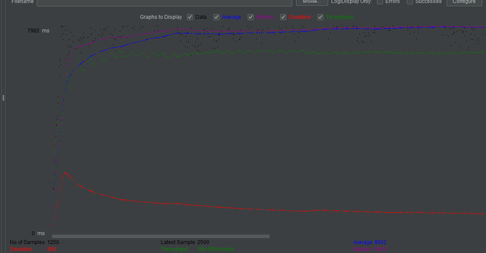
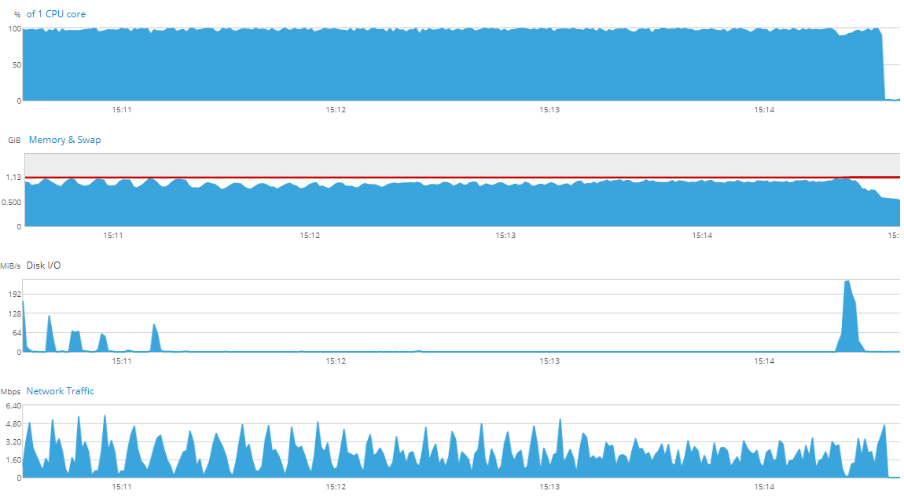

# Enterprise Linux Lab Report

- Student name: Jorn Creten
- Github repo: <https://github.com/HoGentTIN/elnx-2021-ha-JornCreten>

The goal of this iteration is to implement the lamp stack in one device.

## Requirements

- Linux (Centos)
- Apache
- Mariadb
- php (wordpress)
- cockpit (monitoring for load test)

## Test plan

- Open the website on the local ip address (192.168.10.11)
- Install wordpress website
- run load test with jmeter
- log data via cockpit

## Documentation

- Started out by trying to implement the solution manually. Tried to use postgresql and nginx, with very mixed results. I mainly struggled with trying to implement a content management system on centos 8 which I eventually dropped.
- Re-read the assignment and saw the lecturer suggested using his own lamp stack basis
- This machine worked mostly flawless, implemented it in my own folder and changed some variables (mostly passwords and usernames)

## Test report

After initial struggles with other implementations, everything went rather smooth. After setting up the website through the wordpress installation wizard and changing the theme we got

I also did a load test for comparing at later stages

- In this test i had 25 concurrent users request the webpage 50 times, with 5 seconds between every thread. The higher the throughput and the lower the deviation the better

- We can see that the RAM and CPU are fairly evenly utilised but the cpu is the limiting factor in cases with low concurrent users. When the concurrent users go up, the ram usage goes up too.

## Resources
- <https://github.com/bertvv/lampstack>
- <https://jmeter.apache.org/>
- <https://www.guru99.com/jmeter-performance-testing.html>