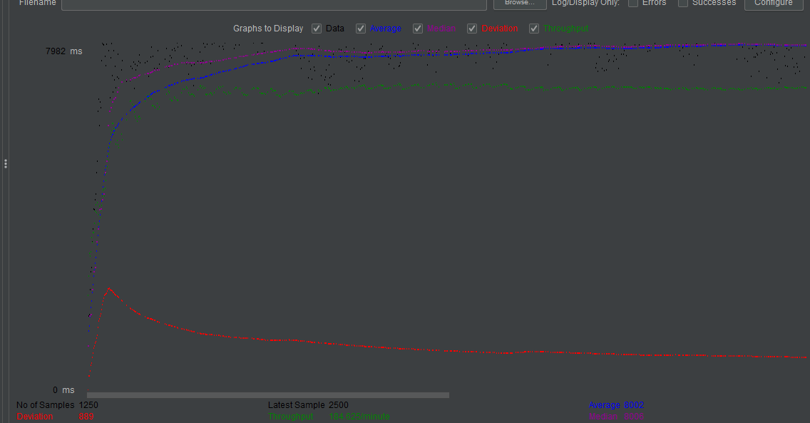
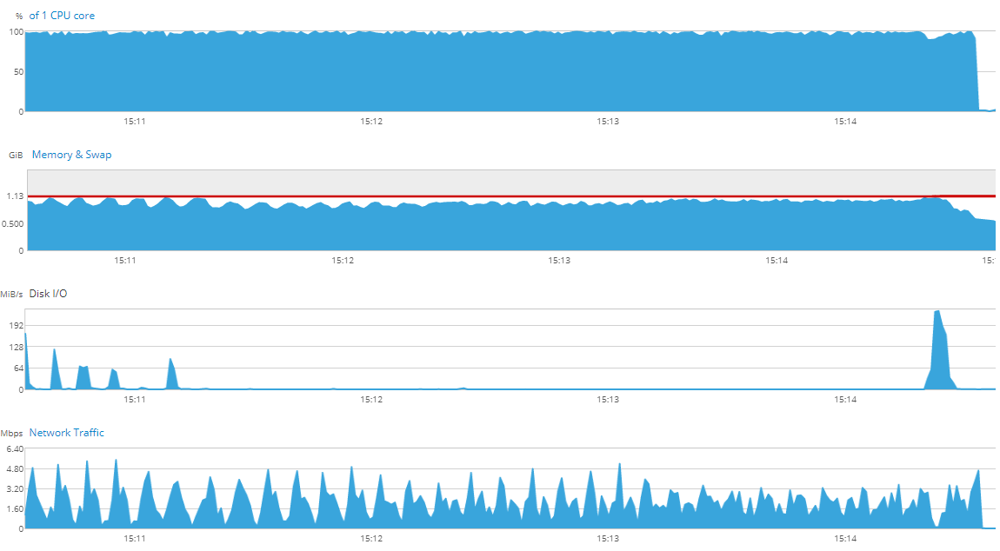

# Enterprise Linux Lab Report

- Student name: Jorn Creten
- Github repo: <https://github.com/HoGentTIN/elnx-2021-ha-JornCreten>

Run the database on a remote server te reduce load

## Requirements

- new machine with mariadb installed
- allow remote connections in firewall
- set correct variables in wordpress config

## Test plan

- Wordpress needs to have access to a database without having a local one installed
- Wordpress needs to be able to install a website
- Load tests to ensure performance is better than with a local database

## Documentation

Started by making a new machine and installing the mariadb role, ensuring variables are right. I struggled with this because at first I did not give the user permissions for the made databank. After this, set the variables for wordpress to use a remote database and you should be good to go.

## Test report
We will do the same test as we did in iteration 1 and compare the results.
- In this test i had 25 concurrent users request the webpage 50 times, with 5 seconds between every thread. The higher the throughput and the lower the deviation the better
This is all the appliances in one machine

- This is with the database separated. what's interesting in this is the traffic between the webserver and the databse. the spikes happen at the same intervals, suggesting that a lot of this date is simply communication between the 2 and also means that the communication is in fact working.

- The throughput is a lot higher, which means our change has worked!

## Resources

<https://cockpit-project.org/guide/172/feature-machines.html>
<https://stackoverflow.com/questions/15872543/access-mysql-remote-database-from-command-line>