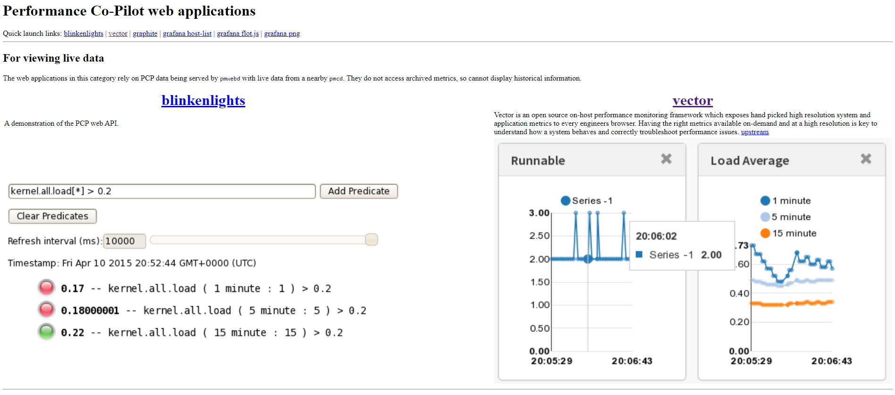
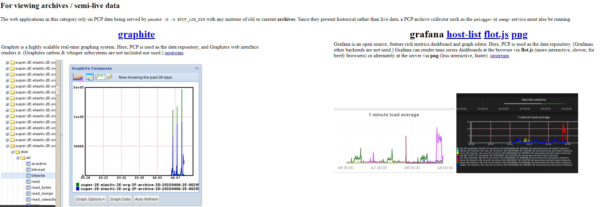
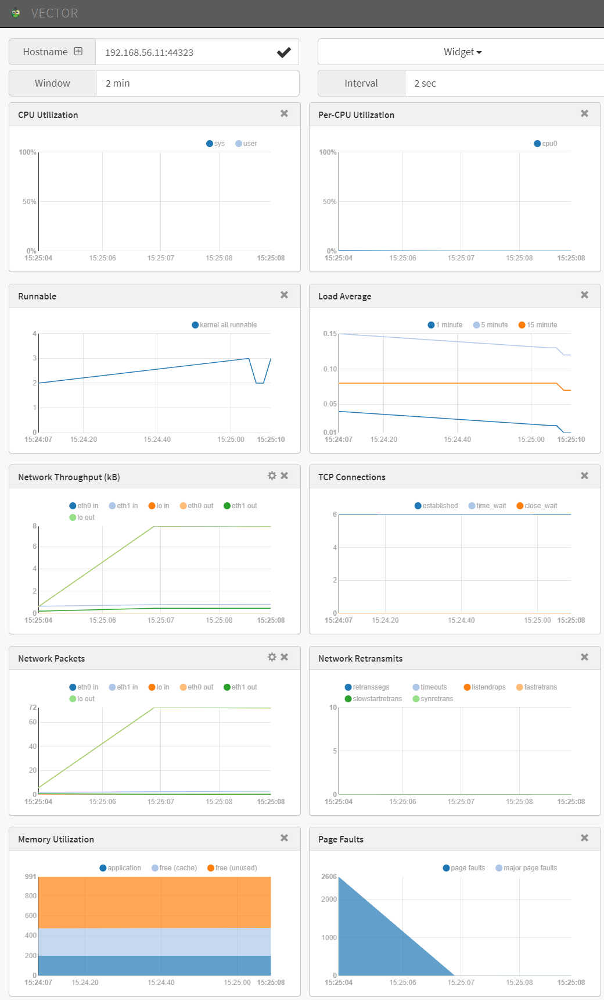

# Enterprise Linux Lab Report

- Student name: Jorn Creten
- Github repo: <https://github.com/HoGentTIN/elnx-2021-ha-JornCreten>

## Required packages:
- pcp
- pcp-system-tools
- pcp-webjs, pcp-webapi, pcp-wepapp-{vector,grafana,graphite}

## Documentation
- Firstly i read up on PCP and what it could do, trying to see how i could use it within my project. I discovered I could use it in a similar way to how i currently use cockpit.

- I found log performance data such as memory used, percentage of cpu used and I/O (through xfs) could easily be live-logged or re-watched afterwards through adding the parameter -a.

- There is a webapp available that can be installed through pcp-webjs, pcp-webapi, pcp-wepapp-{vector,grafana,graphite}. These all show the same logs as the earlier functions but in a nicer graph 
    - to achieve this: 
    ```
    sudo yum install pcp-webapi pcp-web-app-vector pcp-webapp-grafana pcp-webapp-graphite
    sudo systemctl enable pmwebd --now
    sudo firewall-cmd --add-port=44323/tcp
    ```
    - This is not available on centos 8
    - can reach this page by browsing to http://192.168.56.8:44323/
This leads to a webinterface that is very similar to that of cockpit but is slightly more cluttered with a lot more information available at your disposal.



There are many options, my personal favourite being Vector as it provides a live performance interface similar to what cockpit offers but with more data at your disposal, and the possibility to add whichever metric you wish.


The web interface can be set up by selecting the PCP-Client role.

-   this command needs to be executed on the monitoring device
```
echo "192.168.56.11 n n PCP_LOG_DIR/pmlogger/machinename -r -T24h10m -c config.remote"  >> /etc/pcp/pmlogger/control.d/remote
```
- Does not work because file does not exist -> make file manually and add the line with the machine's ip and name


- for listening on the to-be-monitored devices:
Add this option in /etc/pcp/pmcd/pmcd.options
```
-i 192.168.56.x (the x is the host bit of the machine)
```
We also need to enable port 44321/tcp in the firewall for this


## Resources

- <https://access.redhat.com/articles/2450251>
- <https://access.redhat.com/documentation/en-us/red_hat_enterprise_linux/8/html/monitoring_and_managing_system_status_and_performance/monitoring-performance-with-performance-co-pilot_monitoring-and-managing-system-status-and-performance>
- <https://www.youtube.com/watch?v=1Lp4RbjISR8>
