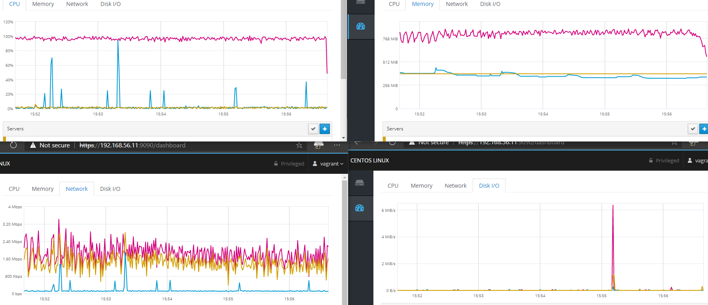
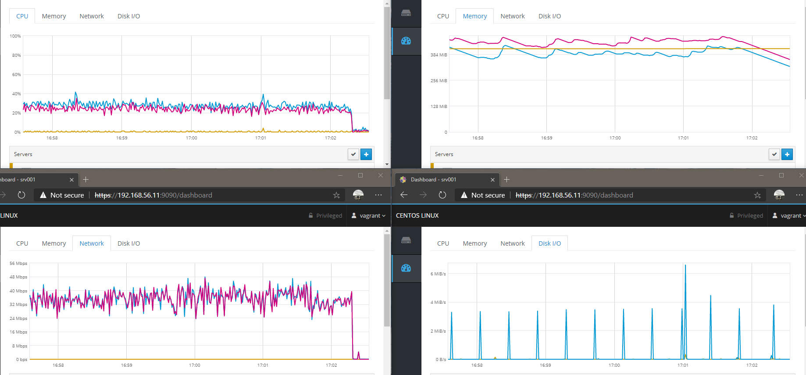

# Enterprise Linux Lab Report

- Student name: Jorn Creten
- Github repo: <https://github.com/HoGentTIN/elnx-2021-ha-JornCreten>

Employ a load balancer to divide the load between 2 web servers

## Requirements
- load balancer
- connection to database from multiple servers

## Test plan

We will do the same tests we have done in previous iterations. if the throughput goes up, this signifies that the implemented loadbalancer works

## Documentation

There was no good, up to date role available so i decided to write my own.
Started with making the setup manually in the vm and testing it, then trying to reproduce it with ansible. The biggest struggle was in figuring out how to import a config file straight into the vm (template module).

## Test report

- I tried to do the same tests as in report 2, comparing against the separate database results as shown below 

- Running the same tests on the new setup ran into a couple of issues, however

* As you can see in the graphs, only one server will be loaded while the other remains mostly untouched. My theory about this is that wordpress tries to keep the session on the same node, and all the traffic therefore sticks to a single server.
* This theory is backed up by the following test: 2000 users to the index.php page (not wordpress index), 50 times

* can also be seen in this gif

- The jmeter results graph is not very readable but you can see the throughput is very high and the servers are equally balanced.

## Resources

- [Load balancing with centos](https://www.linuxtechi.com/install-configure-haproxy-centos-8-rhel-8/#:~:text=HAProxy%20stands%20for%20High%20Availability,backend%20servers%20using%20different%20criteria.)
- [Load balancing with haproxy 2.0.2 ](https://upcloud.com/community/tutorials/haproxy-load-balancer-centos/)
- <https://unix.stackexchange.com/questions/462343/how-to-start-haproxy-on-centos-with-systemd>
- <https://discourse.haproxy.org/t/seamless-reloads-dont-work-with-systemd/1954>
- <https://unix.stackexchange.com/questions/462343/how-to-start-haproxy-on-centos-with-systemd>
- <https://www.linode.com/docs/guides/start-service-at-boot/>